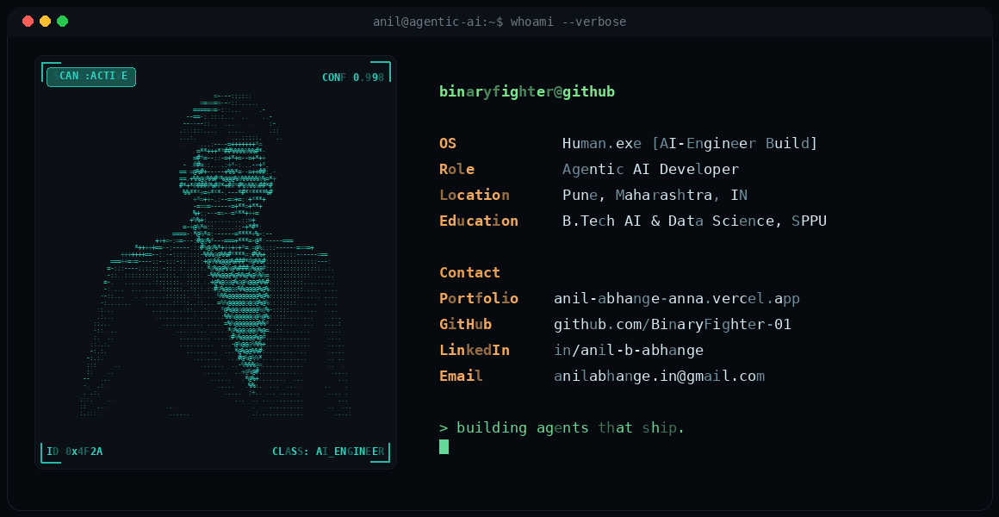

<div align="center">


[...)](https://git.io/typing-svg)

</div>

<!-- ================= HERO / NEOFETCH CARD ================= -->
<div align="center">



</div>

<br>

<!-- ================= ABOUT ================= -->
### `$ cat about.md`

```
> A recent AI & Data Science graduate (SPPU, 2026) who thinks in pipelines, not scripts.
> I build systems that reason, retrieve, and act - not just models that predict.
> Obsessed with the shift from "chatbot demo" to "agent that gets real work done in production."
> Actively targeting Forward Deployed Engineer / Applied AI roles where I sit close to the
  customer, close to the data, and close to the deploy button.
```

<div align="center">
<i>"In the AI era, the edge isn't who trains the biggest model — it's who ships the agent that actually works."</i>
</div>

<br>

<!-- ================= FEATURED WORK ================= -->
### `$ ls -la ./featured-projects/agentic-and-rag`

<table>
<tr>
<td width="50%" valign="top">

**[🧠 Lawbot — RAG Legal Assistant](https://github.com/BinaryFighter-01/Lawbot-RAG-Assistant)**
Retrieval-augmented assistant that grounds LLM answers in legal source documents instead of letting the model hallucinate.

</td>
<td width="50%" valign="top">

**[💬 SmartInterview.AI](https://github.com/BinaryFighter-01/SmartInterview.AI)**
LLM-driven mock interview system — dynamic question generation and response evaluation.

</td>
</tr>
<tr>
<td width="50%" valign="top">

**[🩺 Medicine Chatbot](https://github.com/BinaryFighter-01/Medicine-Chatbot)**
Conversational agent for medicine-related Q&A, built with a retrieval-first design.

</td>
<td width="50%" valign="top">

**[📄 InvoiceIQ](https://github.com/BinaryFighter-01/InvoiceIQ)**
Automated document-intelligence pipeline for extracting structured data out of invoices.

</td>
</tr>
</table>

### `$ ls -la ./featured-projects/computer-vision`

<table>
<tr>
<td width="50%" valign="top">

**[✈️ AeroVision Object Detection](https://github.com/BinaryFighter-01/AeroVision-Object-Detection-System)**
Aerial object-detection system built for real-time inference.

</td>
<td width="50%" valign="top">

**[🚗 Car Detection with YOLOv8](https://github.com/BinaryFighter-01/Car-Detection-with-YOLOv8)**
Real-time vehicle detection pipeline powered by YOLOv8.

</td>
</tr>
<tr>
<td width="50%" valign="top">

**[✍️ Handwritten Digit Recognition](https://github.com/BinaryFighter-01/Handwritten-Digit-Recognition-Project)**
Classic deep-learning classifier — the foundations done right.

</td>
<td width="50%" valign="top">

**[🏥 Medical Image Classification](https://github.com/BinaryFighter-01/Medical-Image-Classification)**
CV model for classifying medical imagery to support diagnostics.

</td>
</tr>
</table>

<div align="center">
<sub>📌 pinned repos are editable anytime from your GitHub profile — pin these six for maximum recruiter impact</sub>
</div>

<br>

<!-- ================= STACK ================= -->
### `$ cat tech_stack.json`

<div align="center">

**Core — proven in production repos**


**Agentic AI & LLM tooling — actively building with**


</div>

<br>

<!-- ================= STATS ================= -->
### `$ ./run_github_stats.sh --live`

<div align="center">


</div>

<br>

<!-- ================= CONTACT ================= -->
### `$ cat contact.sh`

<div align="center">

<a href="https://anil-abhange-anna.vercel.app/" target="_blank">

</a>
<a href="https://linkedin.com/in/anil-b-abhange" target="_blank">

</a>
<a href="mailto:thelight.tor5@gmail.com">

</a>
<a href="https://github.com/BinaryFighter-01" target="_blank">

</a>

<br><br>


<br><br>

<i>&gt; thank you for stopping by. now go build something autonomous.</i> <b>_</b>

</div>


